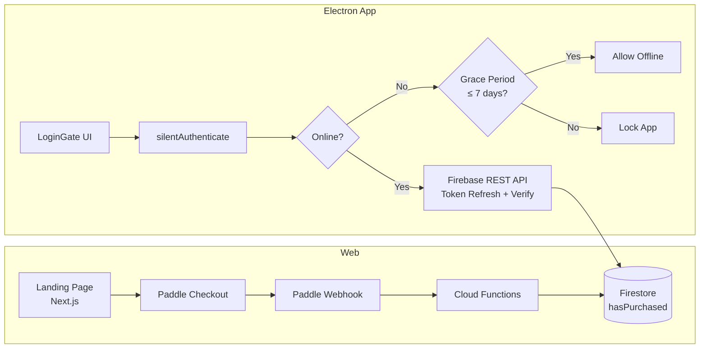

# BanaNyang Web & DRM — PDCA 문서

## 1. Plan (계획)

### 목표

- 글로벌 결제 및 다운로드 랜딩 페이지 구축
- Electron 앱 내 로그인 + 7일 주기 DRM 인증 시스템 구축

### 아키텍처

### Tech Stack

| 계층 | 기술 |
|------|------|
| Web Frontend | Next.js, Tailwind CSS |
| Desktop Client | Electron, React |
| Backend/BaaS | Firebase (Auth, Firestore, Hosting, Functions) |
| Payment | Paddle (Merchant of Record) |

### 비즈니스 모델

- 1회성 구매: **$19.99 USD**
- 타겟: 글로벌 2D/3D 아티스트, 일러스트레이터

---

## 2. Do (실행)

### 2.1 Web Landing Page

- **프로젝트:** `web/` (Next.js + Tailwind, App Router)
- **디자인:** 다크 그리드 배경 (`#0D0D0D`, white grid opacity 3.5%)
- **Hero 섹션:** 앱 아이콘 배경 + 한국어 카피 + Mac/Windows 다운로드 버튼
- **Features 섹션:** 4개 카드 (Infinite Canvas, AI Generation, Reference Board, Smart Tools)
- **Footer:** Terms, Privacy, Contact

### 2.2 Web Backend (Cloud Functions)

- `paddleWebhook`: Paddle 결제 이벤트 → Firestore `hasPurchased: true`
- `onUserCreated`: 신규 가입 → `pending_purchases` 자동 연동
- Firestore Rules: 본인 데이터만 읽기, `lastVerifiedAt`만 업데이트 허용

### 2.3 Electron DRM

| 파일 | 역할 |
|------|------|
| `drmService.ts` | Silent Auth, Grace Period, 이메일/Google 로그인 |
| `firebaseRestClient.ts` | Firebase REST API (Auth + Firestore) |
| `LoginGate.tsx` | 로그인 UI 게이트 컴포넌트 |
| `preload.js` | safeStorage API 노출 (OS 레벨 암호화) |

### DRM 인증 흐름

1. 앱 실행 → `silentAuthenticate()` 호출
2. safeStorage에서 refreshToken 조회
3. 온라인: Firebase REST로 토큰 갱신 + 구매 상태 검증
4. 오프라인: 마지막 인증일로부터 7일 이내면 Grace Period 허용
5. 7일 초과 + 오프라인: 앱 잠금 → 재로그인 요구

---

## 3. Check (검증)

### 자동화 테스트

- DRM 유닛 테스트: `npx vitest run src/services/__tests__/drmService.test.ts`
  - 구매 완료 로그인 → `status: ok`
  - 미구매 로그인 → `status: not_purchased`
  - 잘못된 비밀번호 → `status: error`
  - 토큰 없음 → `status: needs_login`
  - 온라인 + 구매 → `status: ok`
  - 오프라인 7일 이내 → `status: offline_grace`
  - 오프라인 7일 초과 → `status: grace_expired`
  - 로컬 인증 정보 삭제 → 모든 키 삭제 확인

### 빌드 검증

- Next.js: `cd web && npm run build`
- Electron: `npm run build`

### 수동 검증

- Firebase Hosting 배포 후 실제 디바이스 테스트
- Electron 앱 실행 → LoginGate 동작 확인

---

## 4. Act (개선)

### 향후 개선 사항

- [ ] Paddle Billing API v2 서명 검증 (webhook-secret 기반) 업그레이드
- [ ] i18n 다국어 지원 (EN/KO/ZH/JA) 랜딩 페이지 확장
- [ ] 앱 스크린샷/데모 영상 추가 (Features 섹션)
- [ ] 회원가입 폼 (LoginGate에 Sign Up 탭 추가)
- [ ] 구매 후 자동 다운로드 링크 발송 (이메일 통합)
- [ ] Rate limiting + IP 제한 (Cloud Functions 보안 강화)
